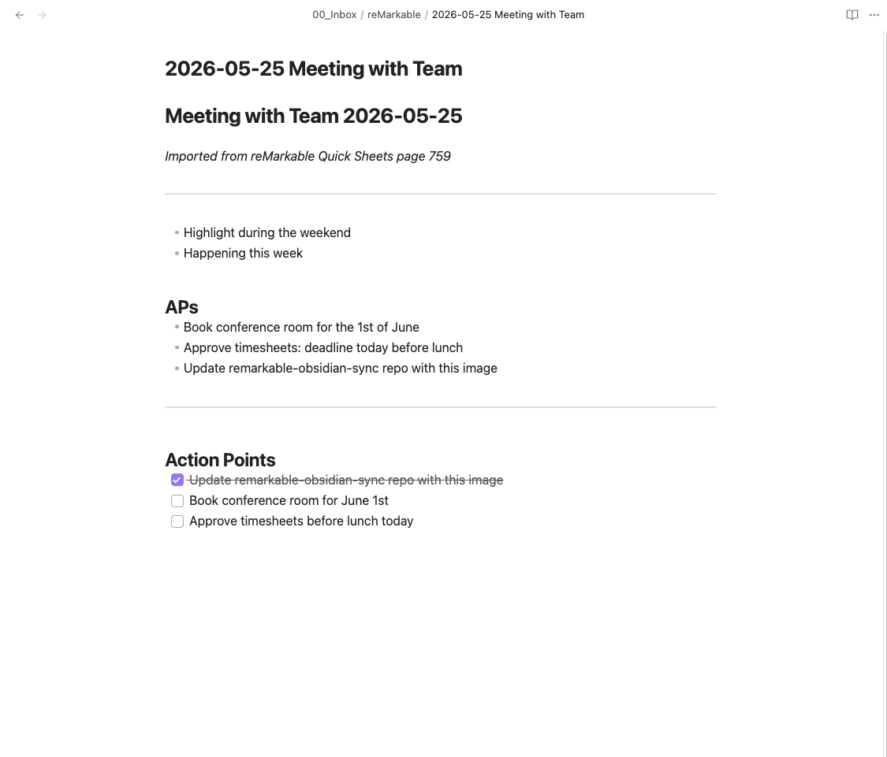

# remarkable-obsidian-sync

> Handwritten notes, as Markdown — ready for Claude Code to read and work with.

A [Claude Code](https://claude.ai/code) skill that converts your reMarkable **Quick Sheets** pages into structured Markdown files. The notes land in your local vault and become part of the knowledge base Claude can read, search, and act on — meeting notes, action points, ideas.

> **Note:** Built specifically for the **Quick Sheets** notebook — the built-in notebook accessible with a swipe from any reMarkable screen. The approach can be adapted to other notebooks.

```
/rmsync
```

That's it.

---

## Quick install

Paste this into Claude Code and ask it to install the skill:

```
Install the skill from https://github.com/Signar/remarkable-obsidian-sync
```

Claude will read the instructions, copy the files, and walk you through any first-time setup — including SSH if needed.

> **Tip:** If you want to sync over WiFi (no cable needed after setup), have your USB cable nearby for the first run. Claude will guide you through a one-time step to enable it.

---

## What happens

1. Claude connects to your reMarkable over WiFi (USB fallback)
2. Downloads new pages from your notebook
3. Converts them using `rmc` + `qlmanage`
4. Reads each page with Claude's vision (no external OCR service)
5. Shows you transcriptions to verify before saving
6. Writes structured Markdown files to your Obsidian inbox
7. Extracts action points automatically
8. Updates a sync log so it knows where to start next time

---

## Example

| You write this on your reMarkable | You get this in Obsidian |
|---|---|
|  |  |

---

## Requirements

| Tool | Version | Install |
|------|---------|---------|
| [Claude Code](https://claude.ai/code) | latest | `npm i -g @anthropic-ai/claude-code` |
| `rmc` | ≥ 0.3.0 | `pip install rmc` |
| `qlmanage` | — | Built into macOS |
| SSH key on reMarkable | — | [See setup](#ssh-setup) |

> **Linux?** Replace `qlmanage` with `rsvg-convert` or `inkscape`. Edit `scripts/rm-convert.sh` line ~55.

---

## Installation

```bash
# 1. Clone
git clone https://github.com/fredrikj31/remarkable-obsidian-sync
cd remarkable-obsidian-sync

# 2. Copy skill to your vault
cp skills/rmsync.md    /path/to/vault/.claude/skills/rmsync.md
cp -r skills/scripts   /path/to/vault/.claude/skills/scripts

# 3. Edit the config section in rmsync.md (top of file)

# 4. Add permissions (see below)
```

### Permissions

Add to your vault's `.claude/settings.json`:

```json
{
  "permissions": {
    "allow": [
      "Bash(ssh -o ConnectTimeout=* root@10.*:*)",
      "Bash(ssh -o ConnectTimeout=* root@192.168.*:*)",
      "Bash(scp -q root@10.*:*)",
      "Bash(scp -q root@192.168.*:*)",
      "Bash(qlmanage -t -s 2000 -o /tmp/rm_sync/*:*)",
      "Bash(rmc:*)",
      "Bash(python3:*)",
      "Bash(bash .claude/skills/scripts/rm-convert.sh:*)",
      "Read(/tmp/rm_sync/**)",
      "Write(00_Inbox/reMarkable/**)"
    ]
  }
}
```

> **What each permission does:**
> - `ssh`/`scp` — scoped to private IP ranges (`10.*`, `192.168.*`) so Claude can only reach local network devices, not arbitrary internet hosts
> - `qlmanage` — macOS built-in thumbnail tool, scoped to the temp sync folder
> - `rmc` — converts reMarkable `.rm` files to SVG (read-only operation)
> - `python3` — parses the notebook's page index (runs inside the convert script)
> - `bash rm-convert.sh` — the bundled helper script that orchestrates download and conversion
> - `Read(/tmp/rm_sync/**)` — lets Claude read the converted PNG images for OCR
> - `Write(00_Inbox/reMarkable/**)` — lets Claude write transcribed notes to your Obsidian inbox

---

## SSH setup

**First time only.** Connect reMarkable via USB cable, then:

```bash
# 1. Find your root password
#    reMarkable: Settings → Help → Copyrights and licenses → scroll to bottom

# 2. Copy your SSH key
ssh-copy-id -i ~/.ssh/id_ed25519.pub -o PubkeyAuthentication=no root@10.11.99.1

# 3. Test it
ssh root@10.11.99.1 "echo connected"
```

After this, SSH works without a password over both USB and WiFi.

---

## Configuration

Edit the `⚙️ USER CONFIGURATION` block at the top of `skills/sync.md`:

| Variable | What it is | Example |
|----------|-----------|---------|
| `VAULT_PATH` | Absolute path to your vault | `~/Documents/MyVault` |
| `INBOX_PATH` | Where to put imported notes | `00_Inbox/reMarkable` |
| `SYNC_LOG` | Sync state file | `_sync_log.md` |
| `DOC_ID` | Your notebook's UUID | `f4e87156-...` |
| `RM_IP_WIFI` | reMarkable's WiFi IP | `192.168.1.42` |
| `RMC_PATH` | Path to `rmc` | `rmc` or `~/bin/rmc` |

### Finding your notebook's UUID

```bash
ssh root@10.11.99.1 \
  "ls /home/root/.local/share/remarkable/xochitl/*.content" \
  | xargs -I{} basename {} .content
```

Match with notebook names in your reMarkable app.

### Finding your reMarkable's IP

**reMarkable:** Settings → Help → Copyrights and licenses → scroll to bottom.

Or scan your network:
```bash
arp -a | grep -i "b8:2d:28"   # if you know it's a reMarkable MAC prefix
```

---

## Sync log

Copy `_sync_log_template.md` from this repo to the path you set as `SYNC_LOG` in your config:

```bash
cp _sync_log_template.md /path/to/vault/_sync_log.md
```

The skill updates it automatically after each sync — you never need to edit it manually.

---

## Troubleshooting

### `KeyError` on conversion (newer firmware)

reMarkable firmware 3.x added pen types that `rmc` 0.3.0 doesn't handle. Fix with one command:

```bash
SITE=$(python3 -c "import rmc, os; print(os.path.dirname(rmc.__file__))")
sed -i '' \
  's/RM_PALETTE\[base_color_id\]/RM_PALETTE.get(base_color_id, (251, 247, 25))/' \
  "$SITE/exporters/writing_tools.py"
```

### IP keeps changing

Set a DHCP reservation in your router for your reMarkable's MAC address.
Find it at: **Settings → Help → Copyrights and licenses**.

### Permission denied over WiFi

Some firmware versions disable SSH over WiFi by default.
Connect via USB and run the SSH key setup — that re-enables it.

---

## How it works

```
reMarkable tablet
  └─ .rm files (reMarkable's proprietary vector format)
       └─ rmc → SVG
            └─ qlmanage → PNG
                 └─ Claude vision (OCR + structure)
                      └─ Markdown → Obsidian vault
```

No external OCR service. No cloud uploads of your notes. Claude reads the PNG images locally using its built-in vision capabilities.

---

## Contributing

PRs welcome. Especially interested in:
- Linux support (`rsvg-convert` path)
- Support for other notebooks beyond Quick Sheets
- Better handling of multi-page meeting notes

---

## License

MIT © Fredrik Johansson
